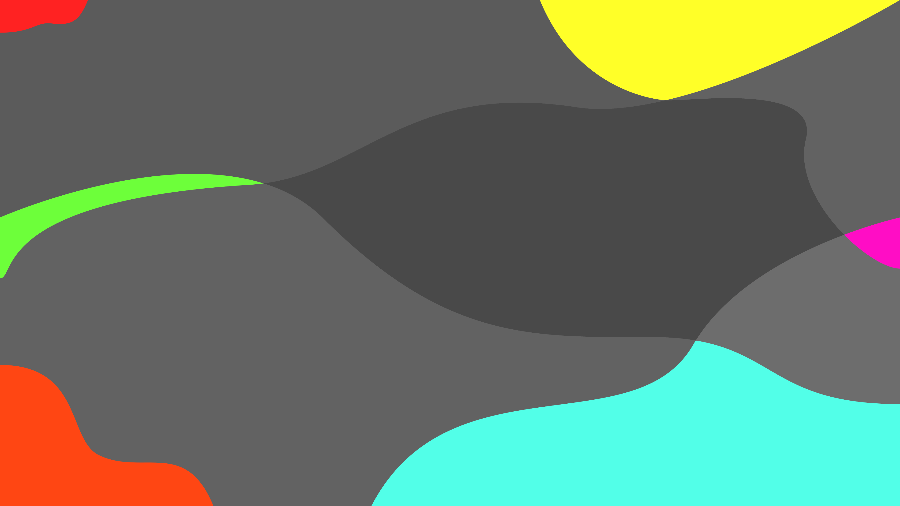

## argon-wallpapers

 - This repository is a collection of wallpapers, designed for use with my other themes
 - All .gif, .xcf, .svg and .png files are licensed under Creative Commons Attribution Share Alike 4.0 International
 - Please credit me if you use my work, a link to my GitHub profile or this repository is enough :)

## Generating wallpapers
 - To recompress the wallpapers in this repository, use `make compress`
   - `optipng` and `make` are required
   - The lossless compression level can be configured with `COMPRESS_LEVEl=-ox make compress`
     - See `optipng` for supported levels
 - To re-export the svg images, use `make wallpapers`
   - Use the `EXPORT_WIDTH` and `EXPORT_HEIGHT` environment variables to change the output resolution
   - To generate a 16:10 aspect ratio, use `make tall`
   - `inkscape` and `make` are required
 - `make set-wallpaper` is designed to be used on GNOME, and won't work with other desktop environments
 - `make wallpapers`, `make tall`, `make compress` and `make generate-all` support multiple cores using `-j[CORES]`

## Wallpapers:
_Preview is compressed, the wallpapers are higher quality_

